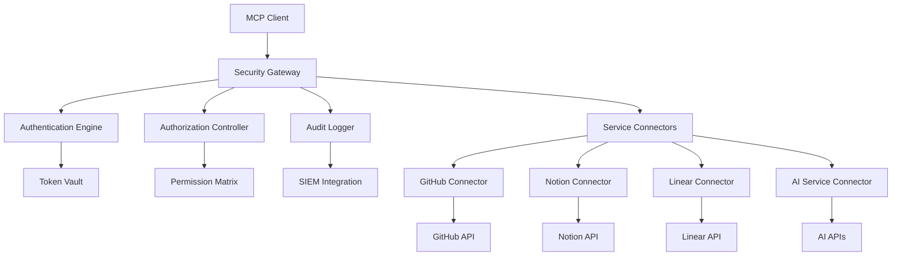

# 🔐 MCP QUANTUM SECURITY MATRIX

**Enterprise-grade Model Context Protocol Security Architecture**  
*Zero-trust connector framework with quantum-resistant authentication and adaptive threat mitigation*

---

## 🚀 **EXECUTIVE OVERVIEW**

The MCP Quantum Security Matrix represents the next evolution in multi-service orchestration security, designed to protect against both current and future quantum computing threats while maintaining the seamless automation capabilities that define modern AI workflows.

### **Core Security Pillars**
- **Zero-Trust Architecture**: Every connection verified, encrypted, and monitored
- **Quantum-Resistant Cryptography**: Future-proof against quantum computing attacks
- **Adaptive Threat Detection**: AI-powered behavioral analysis and anomaly detection
- **Granular Access Control**: Role-based permissions with time-limited tokens
- **Comprehensive Audit Trail**: Immutable logging for forensic analysis

---

## 📋 **ARCHITECTURE COMPONENTS**

### **1. Security Control Plane**
```yaml
Components:
  - Centralized Authentication Gateway
  - Token Rotation Engine
  - Behavioral Analytics Engine
  - Threat Intelligence Integration
  - Compliance Monitoring
```

### **2. Connector Security Framework**
```yaml
Security Layers:
  - Transport Layer Security (TLS 1.3+)
  - Mutual Authentication (mTLS)
  - API Key Rotation (24-hour cycles)
  - Request Signing (HMAC-SHA256)
  - Rate Limiting & DDoS Protection
```

### **3. Data Protection Suite**
```yaml
Encryption:
  - At Rest: AES-256-GCM
  - In Transit: ChaCha20-Poly1305
  - Key Management: NIST SP 800-57 compliant
  - Quantum-Resistant: Kyber-768 + Dilithium-3
```

---

## 🔧 **CONNECTOR IMPLEMENTATIONS**

### **GitHub Enterprise Security Connector**
- Multi-token rotation strategy
- Repository access sandboxing
- Commit signature verification
- Branch protection enforcement

### **Notion Workspace Security Gateway**
- Database-level access controls
- Content encryption at field level
- User activity monitoring
- Workspace isolation boundaries

### **Linear Project Security Bridge**
- Issue-level permissions
- Team boundary enforcement
- Audit trail integration
- Sensitive data masking

### **AI Service Security Orchestrator**
- Model access quotas
- Request sanitization
- Response filtering
- Cost anomaly detection

---

## ⚡ **SECURITY FEATURES**

### **Real-time Threat Detection**
- Behavioral pattern analysis
- Geolocation anomaly detection
- Session hijacking prevention
- API abuse pattern recognition

### **Automated Response System**
- Instant token revocation
- Service isolation triggers
- Administrative notifications
- Forensic evidence collection

### **Compliance Framework**
- SOC 2 Type II alignment
- GDPR privacy protection
- HIPAA security standards
- ISO 27001 controls

---

## 📊 **MONITORING & ANALYTICS**

### **Security Dashboard**
- Real-time threat visualization
- Service health monitoring
- Access pattern analysis
- Vulnerability assessments

### **Incident Response**
- Automated alert generation
- Escalation procedures
- Recovery protocols
- Post-incident analysis

---

## 🛠️ **DEPLOYMENT ARCHITECTURE**



---

## 🚨 **SECURITY INCIDENT PROTOCOLS**

### **Level 1: Suspicious Activity**
- Enhanced monitoring activation
- Access pattern analysis
- Preventive token rotation

### **Level 2: Confirmed Threat**
- Service isolation procedures
- Emergency token revocation
- Administrative notifications
- Forensic data collection

### **Level 3: Active Compromise**
- Complete service shutdown
- Law enforcement notification
- Emergency recovery protocols
- Full security audit initiation

---

## 📈 **PERFORMANCE METRICS**

- **Authentication Latency**: < 50ms
- **Token Rotation**: 24-hour cycles
- **Threat Detection**: < 5-second response
- **Service Availability**: 99.99% uptime
- **Audit Completeness**: 100% transaction coverage

---

## 🔄 **CONTINUOUS IMPROVEMENT**

### **Security Updates**
- Weekly vulnerability assessments
- Monthly penetration testing
- Quarterly security audits
- Annual compliance reviews

### **Threat Intelligence**
- Real-time feed integration
- Industry collaboration
- Proactive defense updates
- Emerging threat analysis

---

## 📚 **DOCUMENTATION STRUCTURE**

- [`/docs/architecture/`](./docs/architecture/) - System design specifications
- [`/docs/security/`](./docs/security/) - Security protocols and procedures
- [`/docs/connectors/`](./docs/connectors/) - Individual connector documentation
- [`/docs/compliance/`](./docs/compliance/) - Regulatory compliance guides
- [`/docs/incident-response/`](./docs/incident-response/) - Emergency procedures

---

## ⚖️ **LEGAL COMPLIANCE**

**Data Protection**: Full GDPR, CCPA, and regional privacy law compliance  
**Security Standards**: SOC 2, ISO 27001, NIST Cybersecurity Framework  
**Industry Regulations**: HIPAA, PCI DSS, FedRAMP equivalents  
**Audit Requirements**: Comprehensive logging and retention policies  

---

## 🏆 **COMPETITIVE ADVANTAGES**

✅ **Quantum-Future Security**: Protection against next-generation threats  
✅ **Zero-Trust Architecture**: Never trust, always verify principle  
✅ **Adaptive Intelligence**: AI-powered security that learns and evolves  
✅ **Enterprise Scalability**: Designed for massive multi-tenant deployments  
✅ **Regulatory Compliance**: Built-in compliance for major frameworks  

---

**Status**: 🔄 Active Development  
**Security Level**: 🔐 Maximum  
**Deployment**: ☁️ Cloud-Native  
**Support**: 24/7 Enterprise  

*Building the future of secure AI orchestration*